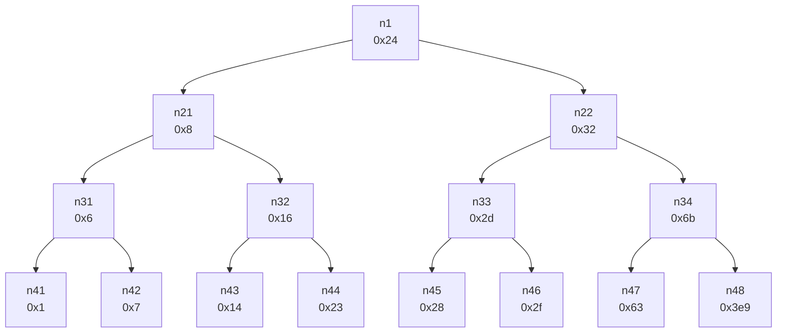

# Phase 1
```assembly
0000000000400ef0 <phase_1>:
  400ef0:	48 83 ec 08          	sub    $0x8,%rsp
  400ef4:	be 7c 25 40 00       	mov    $0x40257c,%esi
  400ef9:	e8 d0 04 00 00       	call   4013ce <strings_not_equal>
  400efe:	85 c0                	test   %eax,%eax
  400f00:	74 05                	je     400f07 <phase_1+0x17>
  400f02:	e8 2d 07 00 00       	call   401634 <explode_bomb>
  400f07:	48 83 c4 08          	add    $0x8,%rsp
  400f0b:	c3                   	ret 
```

```cpp
(gdb) x/s 0x40257c
0x40257c:       "Crikey! I have lost my mojo!"
```

```text
Crikey! I have lost my mojo!
```
# Phase 2
```assembly
0000000000400f0c <phase_2>:
  400f0c:	55                   	push   %rbp
  400f0d:	53                   	push   %rbx
  400f0e:	48 83 ec 28          	sub    $0x28,%rsp
  400f12:	48 89 e6             	mov    %rsp,%rsi
  400f15:	e8 50 07 00 00       	call   40166a <read_six_numbers>
  400f1a:	83 3c 24 00          	cmpl   $0x0,(%rsp)
  400f1e:	75 07                	jne    400f27 <phase_2+0x1b>
  400f20:	83 7c 24 04 01       	cmpl   $0x1,0x4(%rsp)
  400f25:	74 21                	je     400f48 <phase_2+0x3c>
  400f27:	e8 08 07 00 00       	call   401634 <explode_bomb>
  400f2c:	eb 1a                	jmp    400f48 <phase_2+0x3c>
  400f2e:	8b 43 f8             	mov    -0x8(%rbx),%eax
  400f31:	03 43 fc             	add    -0x4(%rbx),%eax
  400f34:	39 03                	cmp    %eax,(%rbx)
  400f36:	74 05                	je     400f3d <phase_2+0x31>
  400f38:	e8 f7 06 00 00       	call   401634 <explode_bomb>
  400f3d:	48 83 c3 04          	add    $0x4,%rbx
  400f41:	48 39 eb             	cmp    %rbp,%rbx
  400f44:	75 e8                	jne    400f2e <phase_2+0x22>
  400f46:	eb 0c                	jmp    400f54 <phase_2+0x48>
  400f48:	48 8d 5c 24 08       	lea    0x8(%rsp),%rbx
  400f4d:	48 8d 6c 24 18       	lea    0x18(%rsp),%rbp
  400f52:	eb da                	jmp    400f2e <phase_2+0x22>
  400f54:	48 83 c4 28          	add    $0x28,%rsp
  400f58:	5b                   	pop    %rbx
  400f59:	5d                   	pop    %rbp
  400f5a:	c3                   	ret    
```

```cpp
void phase_2(int[] number) {
	if (number[0] != 0) {
		explode_bomb();
		return;
	}
	if (number[1] != 1) {
		explode_bomb();
		return;
	}
	for (int i = 2; i < 6; i++) {
		if (number[i] != number[i-2] + number[i-1]) {
			explode_bomb();
		}
	}
}
```

```text
0 1 1 2 3 5
```
# Phase 3
```assembly
0000000000400f5b <phase_3>:
  400f5b:	48 83 ec 18          	sub    $0x18,%rsp
  400f5f:	4c 8d 44 24 08       	lea    0x8(%rsp),%r8
  400f64:	48 8d 4c 24 07       	lea    0x7(%rsp),%rcx
  400f69:	48 8d 54 24 0c       	lea    0xc(%rsp),%rdx
  400f6e:	be 99 25 40 00       	mov    $0x402599,%esi "%d %c %d"
  400f73:	b8 00 00 00 00       	mov    $0x0,%eax
  400f78:	e8 b3 fc ff ff       	call   400c30 <__isoc99_sscanf@plt>
  400f7d:	83 f8 02             	cmp    $0x2,%eax
  400f80:	7f 05                	jg     400f87 <phase_3+0x2c>
  400f82:	e8 ad 06 00 00       	call   401634 <explode_bomb>
  400f87:	83 7c 24 0c 07       	cmpl   $0x7,0xc(%rsp)
  400f8c:	0f 87 f2 00 00 00    	ja     401084 <phase_3+0x129>
  400f92:	8b 44 24 0c          	mov    0xc(%rsp),%eax
  400f96:	ff 24 c5 c0 25 40 00 	jmp    *0x4025c0(,%rax,8)
  400f9d:	b8 61 00 00 00       	mov    $0x61,%eax
  400fa2:	81 7c 24 08 cb 03 00 	cmpl   $0x3cb,0x8(%rsp)
  400fa9:	00 
  400faa:	0f 84 de 00 00 00    	je     40108e <phase_3+0x133>
  400fb0:	e8 7f 06 00 00       	call   401634 <explode_bomb>
  400fb5:	b8 61 00 00 00       	mov    $0x61,%eax
  400fba:	e9 cf 00 00 00       	jmp    40108e <phase_3+0x133>
  400fbf:	b8 75 00 00 00       	mov    $0x75,%eax
  400fc4:	81 7c 24 08 eb 00 00 	cmpl   $0xeb,0x8(%rsp)
  400fcb:	00 
  400fcc:	0f 84 bc 00 00 00    	je     40108e <phase_3+0x133>
  400fd2:	e8 5d 06 00 00       	call   401634 <explode_bomb>
  400fd7:	b8 75 00 00 00       	mov    $0x75,%eax
  400fdc:	e9 ad 00 00 00       	jmp    40108e <phase_3+0x133>
  400fe1:	b8 76 00 00 00       	mov    $0x76,%eax
  400fe6:	83 7c 24 08 66       	cmpl   $0x66,0x8(%rsp)
  400feb:	0f 84 9d 00 00 00    	je     40108e <phase_3+0x133>
  400ff1:	e8 3e 06 00 00       	call   401634 <explode_bomb>
  400ff6:	b8 76 00 00 00       	mov    $0x76,%eax
  400ffb:	e9 8e 00 00 00       	jmp    40108e <phase_3+0x133>
  401000:	b8 72 00 00 00       	mov    $0x72,%eax
  401005:	81 7c 24 08 b0 01 00 	cmpl   $0x1b0,0x8(%rsp)
  40100c:	00 
  40100d:	74 7f                	je     40108e <phase_3+0x133>
  40100f:	e8 20 06 00 00       	call   401634 <explode_bomb>
  401014:	b8 72 00 00 00       	mov    $0x72,%eax
  401019:	eb 73                	jmp    40108e <phase_3+0x133>
  40101b:	b8 77 00 00 00       	mov    $0x77,%eax
  401020:	81 7c 24 08 f2 01 00 	cmpl   $0x1f2,0x8(%rsp)
  401027:	00 
  401028:	74 64                	je     40108e <phase_3+0x133>
  40102a:	e8 05 06 00 00       	call   401634 <explode_bomb>
  40102f:	b8 77 00 00 00       	mov    $0x77,%eax
  401034:	eb 58                	jmp    40108e <phase_3+0x133>
  401036:	b8 75 00 00 00       	mov    $0x75,%eax
  40103b:	81 7c 24 08 e9 02 00 	cmpl   $0x2e9,0x8(%rsp)
  401042:	00 
  401043:	74 49                	je     40108e <phase_3+0x133>
  401045:	e8 ea 05 00 00       	call   401634 <explode_bomb>
  40104a:	b8 75 00 00 00       	mov    $0x75,%eax
  40104f:	eb 3d                	jmp    40108e <phase_3+0x133>
  401051:	b8 67 00 00 00       	mov    $0x67,%eax
  401056:	83 7c 24 08 77       	cmpl   $0x77,0x8(%rsp)
  40105b:	74 31                	je     40108e <phase_3+0x133>
  40105d:	e8 d2 05 00 00       	call   401634 <explode_bomb>
  401062:	b8 67 00 00 00       	mov    $0x67,%eax
  401067:	eb 25                	jmp    40108e <phase_3+0x133>
  401069:	b8 6f 00 00 00       	mov    $0x6f,%eax
  40106e:	81 7c 24 08 b5 00 00 	cmpl   $0xb5,0x8(%rsp)
  401075:	00 
  401076:	74 16                	je     40108e <phase_3+0x133>
  401078:	e8 b7 05 00 00       	call   401634 <explode_bomb>
  40107d:	b8 6f 00 00 00       	mov    $0x6f,%eax
  401082:	eb 0a                	jmp    40108e <phase_3+0x133>
  401084:	e8 ab 05 00 00       	call   401634 <explode_bomb>
  401089:	b8 64 00 00 00       	mov    $0x64,%eax
  40108e:	3a 44 24 07          	cmp    0x7(%rsp),%al
  401092:	74 05                	je     401099 <phase_3+0x13e>
  401094:	e8 9b 05 00 00       	call   401634 <explode_bomb>
  401099:	48 83 c4 18          	add    $0x18,%rsp
  40109d:	c3                   	ret    
```

```cpp
(gdb) x/16wx 0x4025c0
0x4025c0:       0x00400f9d      0x00000000      0x00400fbf      0x00000000
0x4025d0:       0x00400fe1      0x00000000      0x00401000      0x00000000
0x4025e0:       0x0040101b      0x00000000      0x00401036      0x00000000
0x4025f0:       0x00401051      0x00000000      0x00401069      0x00000000
```

```cpp
void phase_3(const char *input_line) {
	int index;
	char ch;
	char val;
	int num;
	int matched;
	
	matched = sscanf(input_line, "%d %c %d", &index, &ch, &num);
	if (matched <= 2) {
		explode_bomb();
		return;
	}
	if (index < 0 || index > 7) {
		explode_bomb();
		return;
	}
	switch(index) {
		case 0:
			val = 'a';
			if (num != 971) {
				explode_bomb();
				val = 'a';
			}
			break;
		case 1:
			val = 'u';
			if (num != 235) {
				explode_bomb();
				val = 'u';
			}
			break;
		case 2:
			val = 'v';
			if (num != 102) {
				explode_bomb();
				val = 'v';
			}
			break;
		case 3:
			val = 'r';
			if (num != 432) {
				explode_bomb();
				val = 'r';
			}
			break;
		case 4:
			val = 'w';
			if (num != 498) {
				explode_bomb();
				val = 'w';
			}
			break;
		case 5:
			val = 'u';
			if (num != 745) {
				explode_bomb();
				val = 'u';
			}
			break;
		case 6:
			val = 'g';
			if (num != 119) {
				explode_bomb();
				val = 'g';
			}
			break;
		case 7:
			val = 'o';
			if (num != 181) {
				explode_bomb();
				val = 'o';
			}
			break;
		default:
			explode_bomb();
			val = 'd';
	}
	if (val != ch) {
	explode_bomb();
	}
	return;
}
```

```text
1) 0 a 971
2) 1 u 235
3) 2 v 102
4) 3 r 432
5) 4 w 498
6) 5 u 745
7) 6 g 119
8) 7 o 181
```
# Phase 4
```assembly
000000000040109e <func4>:
  40109e:	41 54                	push   %r12
  4010a0:	55                   	push   %rbp
  4010a1:	53                   	push   %rbx
  4010a2:	89 fb                	mov    %edi,%ebx
  4010a4:	85 ff                	test   %edi,%edi
  4010a6:	7e 24                	jle    4010cc <func4+0x2e>
  4010a8:	89 f5                	mov    %esi,%ebp
  4010aa:	89 f0                	mov    %esi,%eax
  4010ac:	83 ff 01             	cmp    $0x1,%edi
  4010af:	74 20                	je     4010d1 <func4+0x33>
  4010b1:	8d 7f ff             	lea    -0x1(%rdi),%edi
  4010b4:	e8 e5 ff ff ff       	call   40109e <func4>
  4010b9:	44 8d 24 28          	lea    (%rax,%rbp,1),%r12d
  4010bd:	8d 7b fe             	lea    -0x2(%rbx),%edi
  4010c0:	89 ee                	mov    %ebp,%esi
  4010c2:	e8 d7 ff ff ff       	call   40109e <func4>
  4010c7:	44 01 e0             	add    %r12d,%eax
  4010ca:	eb 05                	jmp    4010d1 <func4+0x33>
  4010cc:	b8 00 00 00 00       	mov    $0x0,%eax
  4010d1:	5b                   	pop    %rbx
  4010d2:	5d                   	pop    %rbp
  4010d3:	41 5c                	pop    %r12
  4010d5:	c3                   	ret    

00000000004010d6 <phase_4>:
  4010d6:	48 83 ec 18          	sub    $0x18,%rsp
  4010da:	48 8d 4c 24 0c       	lea    0xc(%rsp),%rcx
  4010df:	48 8d 54 24 08       	lea    0x8(%rsp),%rdx
  4010e4:	be b5 28 40 00       	mov    $0x4028b5,%esi
  4010e9:	b8 00 00 00 00       	mov    $0x0,%eax
  4010ee:	e8 3d fb ff ff       	call   400c30 <__isoc99_sscanf@plt>
  4010f3:	83 f8 02             	cmp    $0x2,%eax
  4010f6:	75 0c                	jne    401104 <phase_4+0x2e>
  4010f8:	8b 44 24 0c          	mov    0xc(%rsp),%eax
  4010fc:	83 e8 02             	sub    $0x2,%eax
  4010ff:	83 f8 02             	cmp    $0x2,%eax
  401102:	76 05                	jbe    401109 <phase_4+0x33>
  401104:	e8 2b 05 00 00       	call   401634 <explode_bomb>
  401109:	8b 74 24 0c          	mov    0xc(%rsp),%esi
  40110d:	bf 06 00 00 00       	mov    $0x6,%edi
  401112:	e8 87 ff ff ff       	call   40109e <func4>
  401117:	3b 44 24 08          	cmp    0x8(%rsp),%eax
  40111b:	74 05                	je     401122 <phase_4+0x4c>
  40111d:	e8 12 05 00 00       	call   401634 <explode_bomb>
  401122:	48 83 c4 18          	add    $0x18,%rsp
  401126:	c3                   	ret    
```

```cpp
int func4(int n, int m) {
	if (n <= 0) {
		return 0;
	}
	if (n != 1) {
		return m + func4(n-1, m) + func4(n-2, m);
	}
	return m;
}
```

$$
A(n) = A(n-1) + A(n-2) + m
$$

```cpp
void phase_4(const char *input_line) {
	int a, b, c;
	a = sscanf(input_line, "%d %d", &b, &c);
	if (a != 2) {
		explode_bomb();
	}
	if (c >= 2 || c <= 4) {
		explode_bomb();
	}
	a = func4(6, c);
	if (a != b) {
		explode_bomb();
	}
	return;
}
```

$$
\text{func4}(6, c) == b
$$

```text
1) 40 2
2) 60 3
3) 80 4
```

# Phase 5
```assembly
0000000000401127 <phase_5>:
  401127:	48 83 ec 18          	sub    $0x18,%rsp
  40112b:	48 8d 4c 24 08       	lea    0x8(%rsp),%rcx
  401130:	48 8d 54 24 0c       	lea    0xc(%rsp),%rdx
  401135:	be b5 28 40 00       	mov    $0x4028b5,%esi
  40113a:	b8 00 00 00 00       	mov    $0x0,%eax
  40113f:	e8 ec fa ff ff       	call   400c30 <__isoc99_sscanf@plt>
  401144:	83 f8 01             	cmp    $0x1,%eax
  401147:	7f 05                	jg     40114e <phase_5+0x27>
  401149:	e8 e6 04 00 00       	call   401634 <explode_bomb>
  40114e:	8b 44 24 0c          	mov    0xc(%rsp),%eax
  401152:	83 e0 0f             	and    $0xf,%eax
  401155:	89 44 24 0c          	mov    %eax,0xc(%rsp)
  401159:	83 f8 0f             	cmp    $0xf,%eax
  40115c:	74 2c                	je     40118a <phase_5+0x63>
  40115e:	b9 00 00 00 00       	mov    $0x0,%ecx
  401163:	ba 00 00 00 00       	mov    $0x0,%edx
  401168:	83 c2 01             	add    $0x1,%edx
  40116b:	48 98                	cltq   
  40116d:	8b 04 85 00 26 40 00 	mov    0x402600(,%rax,4),%eax
  401174:	01 c1                	add    %eax,%ecx
  401176:	83 f8 0f             	cmp    $0xf,%eax
  401179:	75 ed                	jne    401168 <phase_5+0x41>
  40117b:	89 44 24 0c          	mov    %eax,0xc(%rsp)
  40117f:	83 fa 0f             	cmp    $0xf,%edx
  401182:	75 06                	jne    40118a <phase_5+0x63>
  401184:	3b 4c 24 08          	cmp    0x8(%rsp),%ecx
  401188:	74 05                	je     40118f <phase_5+0x68>
  40118a:	e8 a5 04 00 00       	call   401634 <explode_bomb>
  40118f:	48 83 c4 18          	add    $0x18,%rsp
  401193:	c3                   	ret    
```

```cpp
(gdb) x/16x 0x402600
0x402600 <array.3160>:          0x0000000a      0x00000002      0x0000000e      0x00000007
0x402610 <array.3160+16>:       0x00000008      0x0000000c      0x0000000f      0x0000000b
0x402620 <array.3160+32>:       0x00000000      0x00000004      0x00000001      0x0000000d
0x402630 <array.3160+48>:       0x00000003      0x00000009      0x00000006      0x00000005
```

```cpp
(gdb) x/16u 0x402600
0x402600 <array.3160>:          10      2       14      7
0x402610 <array.3160+16>:       8       12      15      11
0x402620 <array.3160+32>:       0       4       1       13
0x402630 <array.3160+48>:       3       9       6       5
```

```cpp
void phase_5(const char *input_line) {
	int a;
	int cnt;
	int b;
	int index;
	a = sscanf(input_line,"%d %d",&index,&b);
	if (a < 2) {
		explode_bomb();
	}
	index = index & 15;
	if (index != 15) {
		a = 0;
		cnt = 0;
		do {
			cnt = cnt + 1;
			index = *(int *)(0x402600 + index * 4); // => index = arr[index]
			a = a + index;
		} while (index != 15);
		index = 15;
		if ((cnt == 15) && (a == b)) {
			return;
		}
	}
	explode_bomb();
	return;
}
```

```text
0: 10
1: 2
2: 14
3: 7
4: 8
5: 12
6: 15
7: 11
8: 0
9: 4
10: 1
11: 13
12: 3
13: 9
14: 6
15: 5

5 -> 12 -> 3 -> 7 -> 11 -> 13 -> 9 -> 4 -> 8 -> 0 -> 10 -> 1 -> 2 -> 14 -> 6 -> 15
115 => sum(12 ~ 15)
```

```text
5 115
```

# Phase 6
```assembly
0000000000401194 <phase_6>:
  401194:	41 56                	push   %r14
  401196:	41 55                	push   %r13
  401198:	41 54                	push   %r12
  40119a:	55                   	push   %rbp
  40119b:	53                   	push   %rbx
  40119c:	48 83 ec 50          	sub    $0x50,%rsp
  4011a0:	4c 8d 6c 24 30       	lea    0x30(%rsp),%r13
  4011a5:	4c 89 ee             	mov    %r13,%rsi
  4011a8:	e8 bd 04 00 00       	call   40166a <read_six_numbers>
  4011ad:	4d 89 ee             	mov    %r13,%r14
  4011b0:	41 bc 00 00 00 00    	mov    $0x0,%r12d
  4011b6:	4c 89 ed             	mov    %r13,%rbp
  4011b9:	41 8b 45 00          	mov    0x0(%r13),%eax
  4011bd:	83 e8 01             	sub    $0x1,%eax
  4011c0:	83 f8 05             	cmp    $0x5,%eax
  4011c3:	76 05                	jbe    4011ca <phase_6+0x36>
  4011c5:	e8 6a 04 00 00       	call   401634 <explode_bomb>
  4011ca:	41 83 c4 01          	add    $0x1,%r12d
  4011ce:	41 83 fc 06          	cmp    $0x6,%r12d
  4011d2:	74 22                	je     4011f6 <phase_6+0x62>
  4011d4:	44 89 e3             	mov    %r12d,%ebx
  4011d7:	48 63 c3             	movslq %ebx,%rax
  4011da:	8b 44 84 30          	mov    0x30(%rsp,%rax,4),%eax
  4011de:	39 45 00             	cmp    %eax,0x0(%rbp)
  4011e1:	75 05                	jne    4011e8 <phase_6+0x54>
  4011e3:	e8 4c 04 00 00       	call   401634 <explode_bomb>
  4011e8:	83 c3 01             	add    $0x1,%ebx
  4011eb:	83 fb 05             	cmp    $0x5,%ebx
  4011ee:	7e e7                	jle    4011d7 <phase_6+0x43>
  4011f0:	49 83 c5 04          	add    $0x4,%r13
  4011f4:	eb c0                	jmp    4011b6 <phase_6+0x22>
  4011f6:	48 8d 74 24 48       	lea    0x48(%rsp),%rsi
  4011fb:	4c 89 f0             	mov    %r14,%rax
  4011fe:	b9 07 00 00 00       	mov    $0x7,%ecx
  401203:	89 ca                	mov    %ecx,%edx
  401205:	2b 10                	sub    (%rax),%edx
  401207:	89 10                	mov    %edx,(%rax)
  401209:	48 83 c0 04          	add    $0x4,%rax
  40120d:	48 39 f0             	cmp    %rsi,%rax
  401210:	75 f1                	jne    401203 <phase_6+0x6f>
  401212:	be 00 00 00 00       	mov    $0x0,%esi
  401217:	eb 20                	jmp    401239 <phase_6+0xa5>
  401219:	48 8b 52 08          	mov    0x8(%rdx),%rdx
  40121d:	83 c0 01             	add    $0x1,%eax
  401220:	39 c8                	cmp    %ecx,%eax
  401222:	75 f5                	jne    401219 <phase_6+0x85>
  401224:	eb 05                	jmp    40122b <phase_6+0x97>
  401226:	ba f0 42 60 00       	mov    $0x6042f0,%edx
  40122b:	48 89 14 74          	mov    %rdx,(%rsp,%rsi,2)
  40122f:	48 83 c6 04          	add    $0x4,%rsi
  401233:	48 83 fe 18          	cmp    $0x18,%rsi
  401237:	74 15                	je     40124e <phase_6+0xba>
  401239:	8b 4c 34 30          	mov    0x30(%rsp,%rsi,1),%ecx
  40123d:	83 f9 01             	cmp    $0x1,%ecx
  401240:	7e e4                	jle    401226 <phase_6+0x92>
  401242:	b8 01 00 00 00       	mov    $0x1,%eax
  401247:	ba f0 42 60 00       	mov    $0x6042f0,%edx
  40124c:	eb cb                	jmp    401219 <phase_6+0x85>
  40124e:	48 8b 1c 24          	mov    (%rsp),%rbx
  401252:	48 8d 44 24 08       	lea    0x8(%rsp),%rax
  401257:	48 8d 74 24 30       	lea    0x30(%rsp),%rsi
  40125c:	48 89 d9             	mov    %rbx,%rcx
  40125f:	48 8b 10             	mov    (%rax),%rdx
  401262:	48 89 51 08          	mov    %rdx,0x8(%rcx)
  401266:	48 83 c0 08          	add    $0x8,%rax
  40126a:	48 39 f0             	cmp    %rsi,%rax
  40126d:	74 05                	je     401274 <phase_6+0xe0>
  40126f:	48 89 d1             	mov    %rdx,%rcx
  401272:	eb eb                	jmp    40125f <phase_6+0xcb>
  401274:	48 c7 42 08 00 00 00 	movq   $0x0,0x8(%rdx)
  40127b:	00 
  40127c:	bd 05 00 00 00       	mov    $0x5,%ebp
  401281:	48 8b 43 08          	mov    0x8(%rbx),%rax
  401285:	8b 00                	mov    (%rax),%eax
  401287:	39 03                	cmp    %eax,(%rbx)
  401289:	7d 05                	jge    401290 <phase_6+0xfc>
  40128b:	e8 a4 03 00 00       	call   401634 <explode_bomb>
  401290:	48 8b 5b 08          	mov    0x8(%rbx),%rbx
  401294:	83 ed 01             	sub    $0x1,%ebp
  401297:	75 e8                	jne    401281 <phase_6+0xed>
  401299:	48 83 c4 50          	add    $0x50,%rsp
  40129d:	5b                   	pop    %rbx
  40129e:	5d                   	pop    %rbp
  40129f:	41 5c                	pop    %r12
  4012a1:	41 5d                	pop    %r13
  4012a3:	41 5e                	pop    %r14
  4012a5:	c3                   	ret    
```

```cpp
(gdb) x/24x 0x6042f0
0x6042f0 <node1>:       0x00000322      0x00000001      0x00604300      0x00000000
0x604300 <node2>:       0x00000074      0x00000002      0x00604310      0x00000000
0x604310 <node3>:       0x000001b3      0x00000003      0x00604320      0x00000000
0x604320 <node4>:       0x0000010b      0x00000004      0x00604330      0x00000000
0x604330 <node5>:       0x000002ac      0x00000005      0x00604340      0x00000000
0x604340 <node6>:       0x0000031c      0x00000006      0x00000000      0x00000000
```

```cpp
(gdb) x/24u 0x6042f0
0x6042f0 <node1>:       802     1       6308608 0
0x604300 <node2>:       116     2       6308624 0
0x604310 <node3>:       435     3       6308640 0
0x604320 <node4>:       267     4       6308656 0
0x604330 <node5>:       684     5       6308672 0
0x604340 <node6>:       796     6       0       0
```

```python
def phase_6():
    numbers = read_six_numbers()

    if any(n < 1 or n > 6 for n in numbers):
        explode_bomb()
    if len(set(numbers)) != 6:
        explode_bomb()

    numbers = [7 - n for n in numbers]

    node_ptrs = []
    for n in numbers:
        node = list_head
        for _ in range(n - 1):
            node = node.next
        node_ptrs.append(node)

    for i in range(5):
        node_ptrs[i].next = node_ptrs[i+1]
    node_ptrs[5].next = None

    node = node_ptrs[0]
    for i in range(5):
        if node.value < node.next.value:
            explode_bomb()
        node = node.next
```

```text
1) 802 - 796 - 684 - 435 - 267 - 116
2) 1 - 6 - 5 - 3 - 4 - 2
3) 6 - 1 - 2 - 4 - 3 - 5
```

```text
6 1 2 4 3 5
```

# Secret Phase
```assembly
00000000004017d2 <phase_defused>:
  4017d2:	48 83 ec 68          	sub    $0x68,%rsp
  4017d6:	bf 01 00 00 00       	mov    $0x1,%edi
  4017db:	e8 90 fd ff ff       	call   401570 <send_msg>
  4017e0:	83 3d b5 2f 20 00 06 	cmpl   $0x6,0x202fb5(%rip)        # 60479c <num_input_strings>
  4017e7:	75 6d                	jne    401856 <phase_defused+0x84>
  4017e9:	4c 8d 44 24 10       	lea    0x10(%rsp),%r8
  4017ee:	48 8d 4c 24 08       	lea    0x8(%rsp),%rcx
  4017f3:	48 8d 54 24 0c       	lea    0xc(%rsp),%rdx
  4017f8:	be ff 28 40 00       	mov    $0x4028ff,%esi
  4017fd:	bf b0 48 60 00       	mov    $0x6048b0,%edi
  401802:	b8 00 00 00 00       	mov    $0x0,%eax
  401807:	e8 24 f4 ff ff       	call   400c30 <__isoc99_sscanf@plt>
  40180c:	83 f8 03             	cmp    $0x3,%eax
  40180f:	75 31                	jne    401842 <phase_defused+0x70>
  401811:	be 08 29 40 00       	mov    $0x402908,%esi
  401816:	48 8d 7c 24 10       	lea    0x10(%rsp),%rdi
  40181b:	e8 ae fb ff ff       	call   4013ce <strings_not_equal>
  401820:	85 c0                	test   %eax,%eax
  401822:	75 1e                	jne    401842 <phase_defused+0x70>
  401824:	bf 60 27 40 00       	mov    $0x402760,%edi
  401829:	e8 12 f3 ff ff       	call   400b40 <puts@plt>
  40182e:	bf 88 27 40 00       	mov    $0x402788,%edi
  401833:	e8 08 f3 ff ff       	call   400b40 <puts@plt>
  401838:	b8 00 00 00 00       	mov    $0x0,%eax
  40183d:	e8 a2 fa ff ff       	call   4012e4 <secret_phase>
  401842:	bf c0 27 40 00       	mov    $0x4027c0,%edi
  401847:	e8 f4 f2 ff ff       	call   400b40 <puts@plt>
  40184c:	bf f0 27 40 00       	mov    $0x4027f0,%edi
  401851:	e8 ea f2 ff ff       	call   400b40 <puts@plt>
  401856:	48 83 c4 68          	add    $0x68,%rsp
  40185a:	c3                   	ret    
  40185b:	0f 1f 44 00 00       	nopl   0x0(%rax,%rax,1)
```

```cpp
(gdb) x/s 0x402908
0x402908:      "DrJisungPark"
```

> Use this in phase 4

```assembly
00000000004012a6 <fun7>:
  4012a6:	48 83 ec 08          	sub    $0x8,%rsp
  4012aa:	48 85 ff             	test   %rdi,%rdi
  4012ad:	74 2b                	je     4012da <fun7+0x34>
  4012af:	8b 17                	mov    (%rdi),%edx
  4012b1:	39 f2                	cmp    %esi,%edx
  4012b3:	7e 0d                	jle    4012c2 <fun7+0x1c>
  4012b5:	48 8b 7f 08          	mov    0x8(%rdi),%rdi
  4012b9:	e8 e8 ff ff ff       	call   4012a6 <fun7>
  4012be:	01 c0                	add    %eax,%eax
  4012c0:	eb 1d                	jmp    4012df <fun7+0x39>
  4012c2:	b8 00 00 00 00       	mov    $0x0,%eax
  4012c7:	39 f2                	cmp    %esi,%edx
  4012c9:	74 14                	je     4012df <fun7+0x39>
  4012cb:	48 8b 7f 10          	mov    0x10(%rdi),%rdi
  4012cf:	e8 d2 ff ff ff       	call   4012a6 <fun7>
  4012d4:	8d 44 00 01          	lea    0x1(%rax,%rax,1),%eax
  4012d8:	eb 05                	jmp    4012df <fun7+0x39>
  4012da:	b8 ff ff ff ff       	mov    $0xffffffff,%eax
  4012df:	48 83 c4 08          	add    $0x8,%rsp
  4012e3:	c3                   	ret    

00000000004012e4 <secret_phase>:
  4012e4:	53                   	push   %rbx
  4012e5:	e8 c2 03 00 00       	call   4016ac <read_line>
  4012ea:	ba 0a 00 00 00       	mov    $0xa,%edx
  4012ef:	be 00 00 00 00       	mov    $0x0,%esi
  4012f4:	48 89 c7             	mov    %rax,%rdi
  4012f7:	e8 04 f9 ff ff       	call   400c00 <strtol@plt>
  4012fc:	48 89 c3             	mov    %rax,%rbx
  4012ff:	8d 40 ff             	lea    -0x1(%rax),%eax
  401302:	3d e8 03 00 00       	cmp    $0x3e8,%eax
  401307:	76 05                	jbe    40130e <secret_phase+0x2a>
  401309:	e8 26 03 00 00       	call   401634 <explode_bomb>
  40130e:	89 de                	mov    %ebx,%esi
  401310:	bf 10 41 60 00       	mov    $0x604110,%edi
  401315:	e8 8c ff ff ff       	call   4012a6 <fun7>
  40131a:	85 c0                	test   %eax,%eax
  40131c:	74 05                	je     401323 <secret_phase+0x3f>
  40131e:	e8 11 03 00 00       	call   401634 <explode_bomb>
  401323:	bf 40 26 40 00       	mov    $0x402640,%edi
  401328:	e8 13 f8 ff ff       	call   400b40 <puts@plt>
  40132d:	e8 a0 04 00 00       	call   4017d2 <phase_defused>
  401332:	5b                   	pop    %rbx
  401333:	c3                   	ret    
  401334:	66 2e 0f 1f 84 00 00 	cs nopw 0x0(%rax,%rax,1)
  40133b:	00 00 00 
  40133e:	66 90                	xchg   %ax,%ax
```

```cpp
(gdb) x/120wx 0x604110
0x604110 <n1>:          0x00000024      0x00000000      0x00604130      0x00000000
0x604120 <n1+16>:       0x00604150      0x00000000      0x00000000      0x00000000
0x604130 <n21>:         0x00000008      0x00000000      0x006041b0      0x00000000
0x604140 <n21+16>:      0x00604170      0x00000000      0x00000000      0x00000000
0x604150 <n22>:         0x00000032      0x00000000      0x00604190      0x00000000
0x604160 <n22+16>:      0x006041d0      0x00000000      0x00000000      0x00000000
0x604170 <n32>:         0x00000016      0x00000000      0x00604290      0x00000000
0x604180 <n32+16>:      0x00604250      0x00000000      0x00000000      0x00000000
0x604190 <n33>:         0x0000002d      0x00000000      0x006041f0      0x00000000
0x6041a0 <n33+16>:      0x006042b0      0x00000000      0x00000000      0x00000000
0x6041b0 <n31>:         0x00000006      0x00000000      0x00604210      0x00000000
0x6041c0 <n31+16>:      0x00604270      0x00000000      0x00000000      0x00000000
0x6041d0 <n34>:         0x0000006b      0x00000000      0x00604230      0x00000000
0x6041e0 <n34+16>:      0x006042d0      0x00000000      0x00000000      0x00000000
0x6041f0 <n45>:         0x00000028      0x00000000      0x00000000      0x00000000
0x604200 <n45+16>:      0x00000000      0x00000000      0x00000000      0x00000000
0x604210 <n41>:         0x00000001      0x00000000      0x00000000      0x00000000
0x604220 <n41+16>:      0x00000000      0x00000000      0x00000000      0x00000000
0x604230 <n47>:         0x00000063      0x00000000      0x00000000      0x00000000
0x604240 <n47+16>:      0x00000000      0x00000000      0x00000000      0x00000000
0x604250 <n44>:         0x00000023      0x00000000      0x00000000      0x00000000
0x604260 <n44+16>:      0x00000000      0x00000000      0x00000000      0x00000000
0x604270 <n42>:         0x00000007      0x00000000      0x00000000      0x00000000
0x604280 <n42+16>:      0x00000000      0x00000000      0x00000000      0x00000000
0x604290 <n43>:         0x00000014      0x00000000      0x00000000      0x00000000
0x6042a0 <n43+16>:      0x00000000      0x00000000      0x00000000      0x00000000
0x6042b0 <n46>:         0x0000002f      0x00000000      0x00000000      0x00000000
0x6042c0 <n46+16>:      0x00000000      0x00000000      0x00000000      0x00000000
0x6042d0 <n48>:         0x000003e9      0x00000000      0x00000000      0x00000000
0x6042e0 <n48+16>:      0x00000000      0x00000000      0x00000000      0x00000000
```
``` cpp
(gdb) x/120wu 0x604110
0x604110 <n1>:          36      0       6308144 0
0x604120 <n1+16>:       6308176 0       0       0
0x604130 <n21>:         8       0       6308272 0
0x604140 <n21+16>:      6308208 0       0       0
0x604150 <n22>:         50      0       6308240 0
0x604160 <n22+16>:      6308304 0       0       0
0x604170 <n32>:         22      0       6308496 0
0x604180 <n32+16>:      6308432 0       0       0
0x604190 <n33>:         45      0       6308336 0
0x6041a0 <n33+16>:      6308528 0       0       0
0x6041b0 <n31>:         6       0       6308368 0
0x6041c0 <n31+16>:      6308464 0       0       0
0x6041d0 <n34>:         107     0       6308400 0
0x6041e0 <n34+16>:      6308560 0       0       0
0x6041f0 <n45>:         40      0       0       0
0x604200 <n45+16>:      0       0       0       0
0x604210 <n41>:         1       0       0       0
0x604220 <n41+16>:      0       0       0       0
0x604230 <n47>:         99      0       0       0
0x604240 <n47+16>:      0       0       0       0
0x604250 <n44>:         35      0       0       0
0x604260 <n44+16>:      0       0       0       0
0x604270 <n42>:         7       0       0       0
0x604280 <n42+16>:      0       0       0       0
0x604290 <n43>:         20      0       0       0
0x6042a0 <n43+16>:      0       0       0       0
0x6042b0 <n46>:         47      0       0       0
0x6042c0 <n46+16>:      0       0       0       0
0x6042d0 <n48>:         1001    0       0       0
0x6042e0 <n48+16>:      0       0       0       0
```



```cpp
void secret_phase(void)
{
  int result;
  char *s;
  long input;
  
  s = read_line();
  input = strtol(s,(char **)0x0,10);
  if (1000 < (int)input - 1U) {
    explode_bomb();
  }
  result = fun7((int *)n1,(int)lVar2);
  if (result != 0) {
    explode_bomb();
  }
  puts("Wow! You\'ve defused the secret stage!");
  phase_defused();
  return;
}

int fun7(int *node,int val)
{
  int result;
  if (node == (int *)0x0) {
    result = -1;
  }
  else if (val < *node) {
    result = fun7(*(int **)(node + 2),val);
    result = result * 2;
  }
  else {
    result = 0;
    if (*node != val) {
      result = fun7(*(int **)(node + 4),val);
      result = result * 2 + 1;
    }
  }
  return result;
}
```

```text
36
```